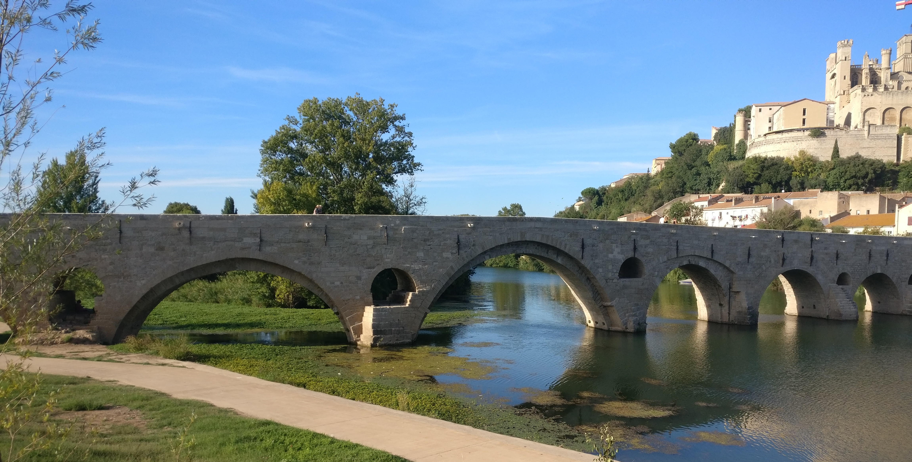
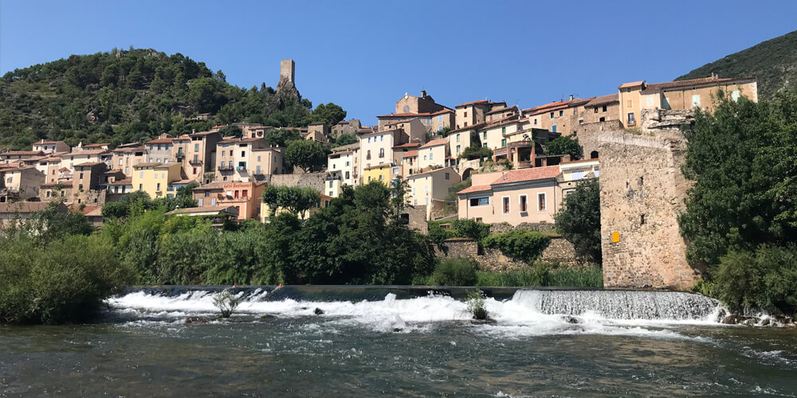
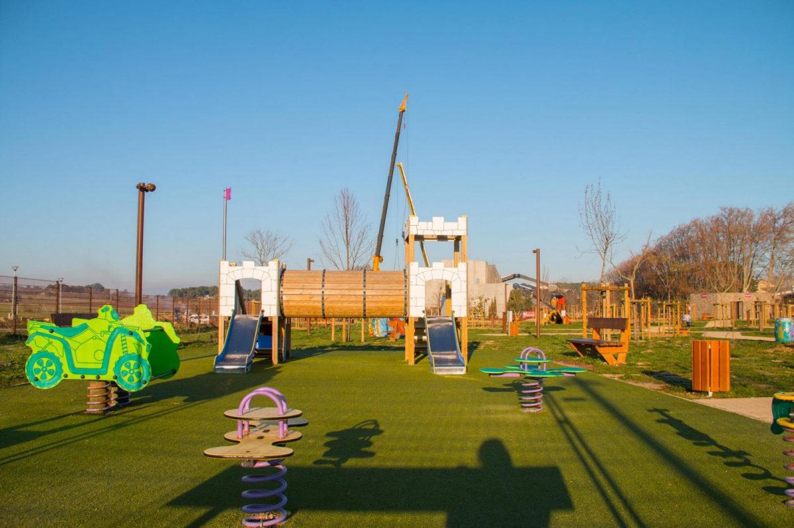

# Days out

## Sightseeing

### Cité de Béziers 

*Travel time: 10 minutes by car*

Béziers is right on the doorstep and definitely worth exploring. One of the best ways to access the city is on foot, across the ancient **Pont Vieux** bridge, which has recently been restored.
The car park for Pont Vieux is completely free and if you are fit enough to manage some steps and walkways, you can easily reach the St Nazaire cathedral in the oldest part of the city. The cathedral is spectacular, with beautiful stained glass windows and far-reaching views across the landscape to the Mediterranean. 

From the cathedral you can wander through the cobbled streets of this ancient city, admire the architecture, and explore the **Les Halles** covered market. The commercial centre of Béziers is the Allées Paul-Riquet, a wide pedestrianised road, which is lined with magnificent plane trees. On many days of the week, this road turns into a bustling market. The Friday flower market is definitely a sight worth seeing.

### Cité de Carcasonne 

*Travel time: 45 - 50 minutes by car*

The medieval citadel of Carcasonne is within easy reach and offers a great day out for
the family. Perched on the hillside, this massive fortification is stunning, with turrets and
battlements that could be straight from a story book.

Inside the walls is a thriving town, with many shops, bars, and restaurants. Visit the cité church,  Basilique St-Nazaire, to see some amazing medieval stained glass windows. The chateau Comtal is a castle within the cité and features some of the best military defences to be found in any ancient castle.

### Canal du Midi

*Travel time: 10+ minutes by car*

The Canal du Midi travels all the way from the Mediterranean to the Atlantic and passes only a few kilometres from the villa. There are many ways to enjoy the canal: walking, cycling or by boat. Some of the most spectacular sections are close by and easy to visit, for example:

- The Beziers aquaduct, which transports the canal over the Orb river.
- Les Écluses de Fonserane, which is series of nine locks that transport boats up or down a  hill.
- The unique round lock in Agde, which provides a choice of three exits, connecting Agde with the Canal du Midi and the Herault river.

It's possible to hire a boat on the canal without a license. We recommend hiring from Sunboats in the nearby village of Colombières. Head off on the canal towards Capestang at a leisurely pace, enjoying the tranquil countryside. On this route there are no locks to master and apart from the amazing Malbec tunnel, the canal is nice and wide. You pass through several pretty villages and can stop off for wine tasting at a local vineyard. If you don't want to take your own picnic, Sunboats will provide one at a small charge.

### Narbonne

*Travel time: 35 minutes by car*

Narbonne is only a short drive and has a great deal to see, including the Archbishops
palace and the impressive Cathedrale-St-Just. 

The simplest route to Narbonne is via the A9 motorway (toll road). However, for a few extra minutes in the car you can reach the city on the back roads, which pass through some interesting villages in the quiet countryside.

Only 8 miles south of Narbonne you can find the Cistercian Abbaye de Fontfroide, with its spectacular cloisters.

Another destination close to Narbonne and worth a visit if you have time is the seaside village of Gruissan. The views across the Mediterranean from the top of the ancient tower are amazing. 

Head South towards Narbonne plage and follow the signs for Gruissan.

### Marseillan

*Travel time: 30 minutes by car*

Marseillan is a small but pretty port on the Etang du Thau, which is famous for its oyster beds. You can take a boat tour around the Etang or sample the latest catch in one of the many  restaurants that line the docks. 

Marseillan is also the home of Noilly Prat, a popular Occitanie liquour. 

If you want to combine this outing with a trip to the beach, take the coastal road to Sète from Marseillan to find one of the longest and most deserted beaches in the Languedoc. We recommend parking at the Three Digues car park (free) to access the beach. 

### Haute Languedoc 

If you head North past Béziers you will find the Parc naturel régional du Haut-Languedoc.
This is an unspoilt landscape of rolling hills covered with chestnut and pine forests. Fast-flowing rivers travel through deep limestone gorges, passing medieval villages that cling to the rock face. There is plenty to see and many hiking routes available.

Some of the villages are steeped in history, dating back to medieval times. 

#### Roquebrun

*Travel time: 40 minutes by car*

A 10th century tower dominates the skyline in this pretty village, which is perched on a hillside that overlooks the river Orb. 

We recommend parking on the near bank of the Orb and crossing the bridge on foot to the ancient part of the village. On the way, you will find a good selection of restaurants, cafes and bars. Wander through the steep, narrow streets of the village up to the tower where you will find a Meditteranean garden (small charge for entry). The views from the tower are magnificent.

#### Olargues

*Travel time: 60 minutes by car*

Olargues is recorded as one of the most beautiful villages in France. This ancient medieval village is almost encircled by the river Jaur and boasts a stunning 12th century bridge, the Pont du Diable or Devil's bridge.

#### Cité de Minerve

*Travel time: 60 minutes by car*

This stunning medieval cité is perched on the edge of a limestone gorge that borders a sweeping dry river bed. Follow the signs to the main car park (small charge), from where you can walk into the old cité. There is much to see inside and outside the cité walls. 

Inside the walls you will find narrow streets lined with traditional houses, most of which are still inhabited. A selection of small shops sell local artisan products, whilst bars and restaurants offer refreshments with fantastic views. 

Outside the walls you can climb down to the dry river bed where the views up to the cité and ancient stone access bridge are stunning.   

Minerve was a stronghold for the Cathars who endured a siege in 1210 against the Abigensian crusade. At the end of the siege, 140 Cathars chose to die at a pyre that was built on the rocky river bed, rather than renounce their faith.

## Activities

### Scène de Bayssan

*Travel time: 10 minutes by car*

At only a short distance from the villa with free parking and plenty of free activities, the Scène de Bayssan has much to offer. For children, an area of 10,000 square metres is devoted to the following resources:  

- huge and colourful children's play park
- skate park 
- basketball court
- football pitch
- table tennis

The site also has a fitness trail, cycle trail, and a jogging trail.

For more information see, <a href="https://scene-de-bayssan.herault.fr/1048-les-espaces-de-loisirs.htm" target="_blank">Scène de Baysann leisure areas: https://scene-de-bayssan.herault.fr/1048-les-espaces-de-loisirs.htm</a>.

In addition to the leisure area, there is an exhibition of sculptures, a theatre, and a Mediterranean garden. 

### Kayaking at Réals

*Travel time: 30 minutes by car*

For a great day out with plenty of excitement, we recommend hiring kayaks or canoes from the centre at Réals, near Cessenon sur Orb. They equip you with safety gear and drive you high into the hills where you return at your own speed down the river. You can choose from 4 different distances between 5 kilometres and 32 kilometres. We recommend the 12 kilometre paddle, which takes 4-5 hours, passing through some amazing scenery and stretches of white water. Take a picnic, stop off en route, bathe in the river, and enjoy!

 

For more information and to book, see <a href="https://www.base-reals.com/en/" target="_blank">Réals Canoe Kayak: https://www.base-reals.com/en/</a>.

### Water sports at Salagou

*Travel time: 45 - 50 minutes by car*

The huge inland Lac du Salagou, near to Clermont L’Herault, has a number of watersports centres
that offer a wide range of activities including sailing, paddleboarding, canoeing, and
pedalos. The lake has many small coves that are ideal for sunbathing and swimming,
without sand! 

If you make the trip, try to fit in the spectacular scenery at the Cirque de Navacelles or the underground cave system at Saint-Guilhem-Le-Desert.

