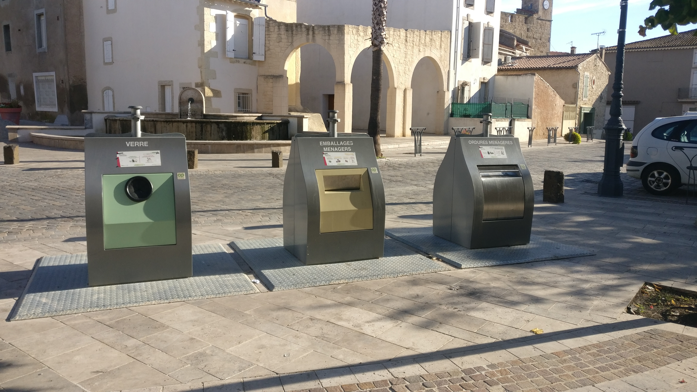

# Les commodités locales

La plupart des commodités mentionnées ici peuvent être trouvées en ligne en utilisant **Google Maps** et la fonction **Directions**.

Pour commencer, ouvert l'adresse de la villa. 

- <a href="https://www.google.com/maps/place/11+Rue+de+la+R%C3%A9volution,+34410+Sauvian,+France/@43.2899838,3.246942,17z/data=!3m1!4b1!4m5!3m4!1s0x12b10ffa6f06af0b:0xb852f731129424ce!8m2!3d43.2899838!4d3.2491307" target="_blank" >11 Rue de la Revolution</a>

## Supermarchés

Les supermarchés les plus proches sont le **Carrefour Contact** (Zac Les Portes de Sauvian) et l'**Utile** (11 Avenue Paul Vidal).

Tous deux sont accessibles en 10 minutes à pied ou en quelques minutes en voiture. 

Le **Carrefour Contact** est le plus grand des deux et est bien approvisionné en produits de consommation courante ainsi qu'en pain frais, des légumes et de la viande. Ce supermarché est ouvert le dimanche matin. 

L'hypermarché le plus proche est **Carrefour Sérignan** (Route de Valras) dans le village voisin de Sérignan, à environ 10 minutes en voiture. Le **Carrefour** est généralement ouvert toute la journée le dimanche pendant la période de pointe de l'été. Vous trouverez également un **Aldi** et un **Lidl** à proximité du **Carrefour**.

## Boucherie et boulangerie

En plus des supermarchés, le village dispose également d'une boucherie et d'une boulangerie indépendantes. 

La boucherie, **Boucherie Chabert** (9 Avenue Paul Vidal), se trouve à côté de l'Utile.

Pour le pain frais, les croissants et autres produits artisanaux, nous vous recommandons **Le Fournil de Sauvian** (25 Avenue Paul Vidal). 

## Pharmacie

Sauvian compte deux pharmacies, situées sur l'avenue Paul Vidal. La plus proche est **Pharmacie La Font Vive** à côté du rond-point principal. Plus loin vers Sérignan, vous trouverez la **Pharmacie Cubizolle**, de couleur rose vif. 

## Bars et restaurants

Plusieurs restaurants et points de vente se trouvent dans le centre de Sauvian, près de la place de l'Eglise :

- **Le Nouvel Air**, un restaurant français traditionnel. 
- **La Buena Vida**, qui propose des repas simples à des prix modestes.
- **Les Temps Moderne**, qui propose des repas et de tapas et des concerts occasionnels.
- **Chèz Boule** (Les Arcades), un café français traditionnel.
- **La Cabane**, qui propose un petit menu méditerranéen.
- **Le table d'Amaya**, notre recommandation pour une pizza rapide à emporter. 

Le dimanche, vous pouvez acheter du poulet fraîchement rôti et du couscous méditerranéen auprès d'un vendeur ambulant, qui utilise le parking du centre de Sauvian. Ses plats sont très appréciés des habitants.

Vous trouverez également un bon choix de restaurants et de bistrots sur la place du marché de Sérignan (3 km), avec des places assises à l'intérieur et à l'extérieur et une bonne ambiance. Pendant la haute saison, la plupart des restaurants proposent un menu du jour à trois plats à un prix incroyablement avantageux!

Nous vous recommandons également **La Table de Rive Gauche** (Route de la Maire), sur la rive de l'Orb à Sérignan.

Valras Plage (7km), dispose d'un grand nombre de restaurants, dont beaucoup sont spécialisés dans les fruits de mer locaux.

Pour un repas au bord du Canal du Midi, rendez-vous à Villeneuve-les-Beziers où nous pouvons vous recommander **La Cremade** pour une pizza traditionnelle cuite au feu de bois.

## Office de tourisme 

L'office de tourisme le plus proche se trouve à Sérignan. Traversez Sauvian sur l'avenue Paul Vidal. En entrant dans Sérignan, l'office de tourisme se trouve sur le côté gauche de la route, juste avant le rond-point. Prendre la dernière sortie du rond-point pour le parking.

## Service de bus

La compagnie de bus beeMob assure la liaison entre Béziers et Vendres, en passant par les villages de Sauvian et de Sérignan. Le bus circule régulièrement pendant la journée et assez tard dans la soirée en haute saison. Le coût est de 1 euro par trajet, quelle que soit la destination sur la ligne de bus. Il est également possible d'acheter une carte journalière pour 3 euros ou un carnet de tickets à utiliser partout sur le réseau de bus beeMob de Béziers.

La ligne de bus et les horaires sont disponibles en ligne sur les sites suivants :

- [Ligne E horaires des bus: https://maps.mybus.io/beziers/voyager/lignes/de-gaulle-port-conchylicole/](https://maps.mybus.io/beziers/voyager/lignes/de-gaulle-port-conchylicole/) 
- [Ligne E itinéraire des bus: https://maps.mybus.io/beziers/voyager/plan-du-reseau/](https://maps.mybus.io/beziers/voyager/plan-du-reseau/)

Il y a 8 arrêts de bus sur la route principale qui traverse Sauvian. Tous sont clairement indiqués sur Google maps. L'arrêt de bus le plus proche de la villa est **Font Vive** sur la route de Béziers, près du supermarché G20. 

## Aires de jeux pour enfants

Il y a des aires de jeux pour tous les âges dans le parc derrière la villa, y compris des structures d'escalade, des balançoires et un terrain de basket-ball. Si vous tournez à droite et traversez le parc jusqu'au bout de la route, vous trouverez un circuit cyclable, une salle de fitness et un pumptrack. Toutes ces commodités sont gratuites.

A 10 minutes en voiture, la **Scène de Bayssan** offre une énorme aire de jeux pour les enfants avec de grands cadres d'escalade colorés, des balançoires et des toboggans. Voir [Jours d'excursion, Scène de Bayssan](daysout.md#scene-de-bayssan).

## Complexe aquatique

Sauvian s'enorgueillit d'un complexe de natation extraordinaire, appelé le centre aquatique Alfred Nakache. Outre une piscine intérieure de 25 mètres, il y a également une piscine olympique chauffée de 50 mètres en plein air. Le terrain comprend également une aire de jeux d'eau pour les enfants et un énorme toboggan à vagues. 

Les prix et les horaires d'ouverture peuvent être consultés en ligne à l'adresse suivante,  [Centre Aquatique Alfred Nakache: https://www.beziers-mediterranee.com/equipement/centre-aquatique-alfred-nakache/](https://www.beziers-mediterranee.com/equipement/centre-aquatique-alfred-nakache/).

## Point de vente

Le distributeur de billets le plus proche se trouve à l'extérieur de **La Poste**, rue Neuve, à Sauvian.

## Bacs communautaires

Les poubelles communales, comme le montre la photo suivante, se trouvent dans la **Rue des Horts** et sur l'**Avenue de l'Eglise**, à côté du cimetière. 

Les poubelles acceptent les bouteilles en verre, le recyclage et les déchets ménagers. A la fin de votre séjour, veuillez jeter tous les déchets restants dans ces poubelles. La société de gestion immobilière facturera les poubelles non vidées.

