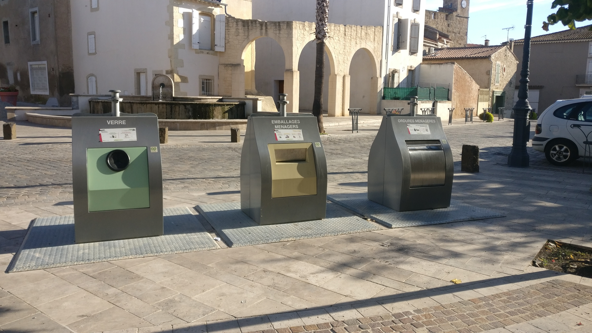

# Local amenities

As a useful starting point, here is a link to the location of the villa on Google Maps: 

- <a href="https://www.google.com/maps/place/11+Rue+de+la+R%C3%A9volution,+34410+Sauvian,+France/@43.2899838,3.246942,17z/data=!3m1!4b1!4m5!3m4!1s0x12b10ffa6f06af0b:0xb852f731129424ce!8m2!3d43.2899838!4d3.2491307" target="_blank" >11 Rue de la Revolution</a>

Most of the amenities mentioned here can be found by using the Google Maps **Directions** function.

## Supermarkets

The closest supermarkets are the **G20** (Zac Les Portes de Sauvian) and the **Utile** (11 Avenue  Paul Vidal).

Both take about 10 minutes to walk to, or just a couple of minutes by car. 

The **G20** is the larger of the two and is well stocked with everyday goods as well as fresh
bread, vegetables, and meat. On most days they also have a fresh fish counter. This
supermarket is open on a Sunday morning. 

The nearest hypermarket is **Carrefour** (Route de Valras) in the neighbouring village of Sérignan, which is about a 10 minute drive. The **Carrefour** is usually open all day on Sundays during the peak summer period. You can also find an **Aldi** and **Lidl** close to the **Carrefour** store.

## Butchers and bakery

In addition to the supermarkets, the village also has an independant butchers and bakery. 

The butchers, **Boucherie Chabert** (9 Avenue Paul Vidal), can be found next to the Utile.

For fresh bread, croissants, and other artisan products, we recommend **Le Fournil de Sauvian** (25 Avenue Paul Vidal). 

## Pharmacy

Sauvian has two pharmacies, located on Avenue Paul Vidal. The closest is **Pharmacie La Font Vive** next to the main roundabout. Further towards Sérignan you can find the bright pink **Pharmacie Cubizolle**. 

## Bars and restaurants

Several restaurants and food outlets can be found in the centre of Sauvian by Place de l'Eglise:

- **Le Nouvel Air**, a traditional French restaurant. 
- **La Buena Vida**, offering simple meals at modest prices.
- **Divin Café**, offering a great selection of tapas with occasional live music entertainment.
- **Chèz Boule** (Les Arcades), a traditional French cafe.
- **La Cabane**, offering a small Mediterranean menu.
- **Pizza Atina**, our recommendation for a quick takeaway pizza. 

On a Sunday you can buy freshly roasted chicken and Mediterranean couscous from a
mobile vendor, who uses the car park in the centre of Sauvian. His food is very popular with the locals.

You can also find a good selection of restaurants and bistros in the Sérignan market
square (3km), with indoor and outdoor seating available plus a great atmosphere. During
peak season, most of the restaurants offer a three-course *menu du jour* at amazingly good
value!

We can also recommend **La Table de Rive Gauche** (Route de la Maire), on the bank of the River Orb in Sérignan.

Valras Plage (7km), has a vast array of restaurants, many specialising in local seafood.

For a meal by the Canal du Midi, head for Villeneuve-les-Beziers where we can
recommend **La Cremade** for traditional wood fired pizza.

## Tourist office 

The closest tourist office is in Sérignan. Travel through Sauvian on the Avenue Paul Vidal. On entering Sérignan, the tourist office can be found on the left hand side of the road, just before the roundabout. Take the last exit from the roundabout for the car park.

## Bus service

The beeMob bus company provide a service that runs between Beziers and Vendres, passing through Sauvian and Sérignan villages. The bus runs regularly during the day and quite late into the evening in peak season. The cost is 1 euro per journey, regardless of the destination on the bus route. You can also buy a day pass for 3 euros or a booklet of tickets to use anywhere on the Beziers beeMob bus network.

For more information, see:

- [Ligne E: Bus schedule](https://maps.mybus.io/beziers/voyager/lignes/de-gaulle-port-conchylicole/) 
- [Ligne E: Bus route](https://maps.mybus.io/beziers/voyager/plan-du-reseau/)

There are 8 bus stops on the main road through Sauvian. All are clearly marked on Google maps. The closest bus stop to the villa is **Font Vive** on Route de Beziers, by the G20 supermarket. 

## Children's play areas

There are play areas to suit all age groups in the park behind the villa. 

You can also find an alternative park in Rue des Tulipes, which contains skate ramps and a small area for younger children with swings and slides.

Within a 10 minute drive, the **Scène de Bayssan** provides an enormous play area for children with large colourful climbing frames, swings, and slides. For more information, see [Scène de Bayssan](daysout.md#scene-de-bayssan).

## Swimming complex

Sauvian boasts an amazing swimming complex, called the Alfred Nakache Aquatic centre. As well as an indoor 25 metre pool, there is also an outdoor heated 50 metre Olympic pool. The grounds also include a children's water play area and a huge wave slide. 

For prices and opening times, see [Centre Aquatique Alfred Nakache](https://www.beziers-mediterranee.com/equipement/centre-aquatique-alfred-nakache/).

## Cashpoint

The closest cash point is outside **La Poste** on Rue Neuve, Sauvian.

## Community bins

Community bins, as shown in the following photo, can be found on the **Rue des Horts** and on the **Avenue de l'Eglise**, next to the cemetary. 

The bins take glass bottles, recycling, and household waste. At the end of your stay, please dispose of any remaining rubbish in these bins. The property management company will charge for any bins that are left unemptied.

